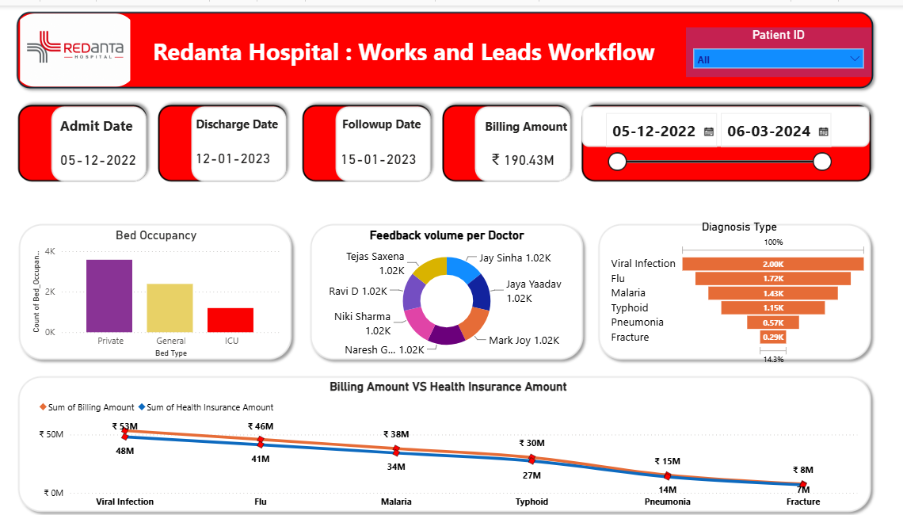

# 🏥 Hospital Management Data Analytics Project

An end-to-end **Hospital Management Data Analytics Project** built to analyze hospital operations, patient information, doctor performance, appointments, treatment data, and financial performance using **Power BI, SQL, Python, and Excel/CSV**.

The project transforms hospital data into meaningful business insights through **data cleaning, SQL analysis, Python EDA, and an interactive Power BI dashboard**.

---

## 📌 Project Overview

Hospitals generate large amounts of operational and patient-related data every day. Analyzing this data can help management understand patient trends, hospital performance, revenue, doctor productivity, and resource utilization.

This project analyzes hospital data from multiple perspectives using:

* 🐍 Python for data cleaning and exploratory data analysis
* 🗄️ SQL for querying and extracting business insights
* 📊 Power BI for interactive dashboards and visualization
* 📑 Excel/CSV as the source dataset

The project demonstrates an end-to-end **Data Analyst workflow** from raw data to business insights.

---

## 🎯 Business Problem

Hospital management needs an effective way to monitor:

* Patient admissions and discharges
* Hospital revenue
* Bed occupancy
* Doctor performance
* Appointment status
* Department performance
* Patient demographics
* Treatment and diagnosis trends
* Length of patient stay
* Insurance and billing information

The goal of this project is to create a centralized analytical solution that helps identify trends and supports data-driven decision-making.

---

# 🎯 Project Objectives

The major objectives of this project are:

* Analyze overall hospital performance
* Track patient admissions and discharges
* Analyze hospital revenue
* Monitor doctor performance
* Analyze department-wise patient distribution
* Understand appointment trends
* Analyze patient demographics
* Calculate average length of stay
* Analyze billing and insurance amounts
* Identify important healthcare trends
* Build an interactive Power BI dashboard

---

# 🛠️ Tools & Technologies

| Tool           | Purpose                           |
| -------------- | --------------------------------- |
| 🐍 Python      | Data Cleaning, EDA & Analysis     |
| 📊 Pandas      | Data Manipulation                 |
| 🔢 NumPy       | Numerical Analysis                |
| 📈 Matplotlib  | Data Visualization                |
| 📉 Seaborn     | Statistical Visualization         |
| 🗄️ SQL        | Data Querying & Business Analysis |
| 📊 Power BI    | Dashboard & Data Visualization    |
| 🔄 Power Query | Data Transformation               |
| 🧮 DAX         | Measures & KPIs                   |
| 📑 Excel / CSV | Dataset                           |

---

# 📂 Dataset

The dataset used in this project is a **synthetically generated hospital dataset** created for educational and portfolio purposes.

The dataset contains hospital-related information such as:

* Patient ID
* Admission Date
* Discharge Date
* Diagnosis
* Bed Occupancy
* Test
* Doctor
* Follow-up Date
* Feedback
* Billing Amount
* Health Insurance Amount
* Patient information
* Hospital operational information

---

# 🐍 Python Data Analysis

Python was used to perform data cleaning, exploration, analysis, and visualization.

### Key Python Tasks

* Load hospital dataset
* Check dataset shape
* Check data types
* Identify missing values
* Detect duplicate records
* Convert date columns
* Analyze patient length of stay
* Calculate total billing amount
* Calculate total health insurance amount
* Perform monthly revenue analysis
* Analyze patient and doctor data
* Perform group-by analysis
* Create charts and visualizations

### Python Libraries

```python
import pandas as pd
import numpy as np
import matplotlib.pyplot as plt
import seaborn as sns
```

---

# 🗄️ SQL Analysis

SQL was used to answer business questions from the hospital dataset.

### Example SQL Analysis

* Find total number of patients
* Find total hospital revenue
* Calculate total health insurance amount
* Calculate monthly revenue
* Find patients with long hospital stays
* Analyze doctor-wise patients
* Analyze department-wise performance
* Find average billing amount
* Analyze patient admissions
* Analyze discharge trends
* Identify missing or invalid values

Example:

```sql
SELECT 
    SUM(Billing_Amount) AS Total_Revenue
FROM Redanta_Hospital;
```

---

# 📊 Power BI Dashboard

The Power BI dashboard provides an interactive view of hospital operations and performance.

### Key KPIs

* 👥 Total Patients
* 🏥 Total Admissions
* 🚪 Total Discharges
* 🛏️ Bed Occupancy
* 💰 Total Revenue
* 🩺 Doctor Performance
* 📅 Appointment Count
* ⏱️ Average Length of Stay

---

# 📈 Dashboard Analysis

## 👥 Patient Analysis

The dashboard analyzes:

* Total patients
* Patient demographics
* Gender distribution
* Age groups
* Diagnosis distribution
* Department-wise patients

---

## 🏥 Admission & Discharge Analysis

The dashboard tracks:

* Daily admissions
* Monthly admissions
* Patient discharge trends
* Patient flow
* Admission patterns

---

## 🛏️ Bed Occupancy Analysis

The dashboard provides information about:

* Occupied beds
* Available beds
* Bed utilization
* Department-wise bed occupancy

---

## 👨‍⚕️ Doctor Performance

Doctor-level analysis includes:

* Number of patients handled
* Patient distribution
* Doctor-wise revenue
* Treatment performance
* Average consultation-related metrics

---

## 🏢 Department Analysis

Departments can be compared based on:

* Number of patients
* Revenue
* Bed occupancy
* Average billing
* Treatment activity

---

## 📅 Appointment Analysis

The project analyzes:

* Total appointments
* Completed appointments
* Cancelled appointments
* Appointment trends
* Date-wise appointment activity

---

## 💰 Revenue Analysis

Financial analysis includes:

* Total billing amount
* Monthly revenue
* Doctor-wise revenue
* Department-wise revenue
* Health insurance amount
* Average billing amount

---

# 📷 Dashboard Preview



---

# 📷 Dashboard Preview

!


---

# 📷 Dashboard Preview

!


---

# 🔄 Project Workflow

```text
Raw Hospital Data
        ↓
Data Cleaning
        ↓
Data Transformation
        ↓
Python EDA
        ↓
SQL Business Analysis
        ↓
Data Modeling
        ↓
DAX Calculations
        ↓
Power BI Dashboard
        ↓
Business Insights
```

---

# 📁 Repository Structure

```text
Hospital-Management-Project/
│
├── DashboardScreenshot.png
│
├── HospitalManagemaent.ipynb
│
├── HospitalProjectBi.pbix
│
├── Hospital_Management_project.sql
│
├── Papollo-Healtcare-Dataset.xlsx - Sheet1.csv
│
└── README.md
```

---

# 🔍 Key Business Questions

This project answers questions such as:

1. How many patients were treated by the hospital?
2. What is the total hospital revenue?
3. What is the total health insurance amount?
4. What is the monthly revenue?
5. Which doctors handled the most patients?
6. Which departments have the highest patient volume?
7. What is the average patient length of stay?
8. What are the most common diagnoses?
9. How does patient admission vary over time?
10. What is the distribution of patients by gender?
11. Which departments generate the highest revenue?
12. What percentage of appointments are completed?
13. Which patients have a length of stay greater than 10 days?
14. What is the average billing amount?
15. How does hospital performance change month by month?

---

# 💡 Key Insights

The analysis can help hospital management:

* Identify departments with high patient volumes
* Monitor hospital revenue
* Understand patient admission trends
* Track doctor workload
* Monitor bed utilization
* Identify appointment trends
* Analyze patient demographics
* Understand billing and insurance patterns
* Improve resource allocation
* Support data-driven operational decisions

---

# 🚀 Future Improvements

Possible improvements include:

* Real-time hospital data integration
* SQL Server database integration
* Automated Power BI refresh
* Patient readmission analysis
* Bed occupancy forecasting
* Revenue forecasting
* Doctor performance scorecards
* Power BI Row-Level Security
* Power BI Service deployment
* Predictive healthcare analytics

---

📷 Dashboard Preview
Power BI Hospital Management Dashboard

https://github.com/lokesh7com/Hospital-Management-Project/blob/main/DashboardScreenshot.png

🐍 Python Analysis Preview

https://github.com/lokesh7com/Hospital-Management-Project/blob/main/Python.png

🗄️ SQL Analysis Preview

https://github.com/lokesh7com/Hospital-Management-Project/blob/main/Sql.png

# 👨‍💻 Author

**Lokesh Kumar**

Data Analyst | SQL | Python | Power BI | Excel

### GitHub

[GitHub Profile](https://github.com/lokesh7com)

---

## ⭐ Project

If you find this project useful, feel free to ⭐ the repository.

**This project demonstrates an end-to-end Data Analyst workflow using Python, SQL, Power BI, and Excel/CSV.**
